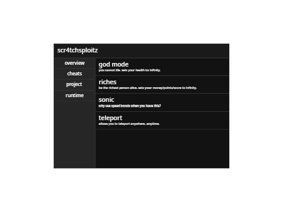

# scr4tchsploitz
general mod menu for scratch games

# introduction
scratch is a platform for users to create simple clicker or shooter games. most of these games are very simple, and thus are easily reverse-engineered.
scr4tchsploitz is a tool to allow the player to modify the game, including but not limited to gaining infinite health, money, teleportation, etc.

# disclaimer
this software is strictly intended for educational, experimental, and parody purposes only.

# acknowledgements

## inspirations
- c00lgui (roblox)
- [scralyx](https://scralyx.carrd.co)

## oss used
- scratch-vm
- scratch-render
- electron
- chromium
- node.js
- reactjs

## developers
- main developer: lhanhs (me)
- mod techniques: [@vitor-balmante](https://scratch.mit.edu/users/vitor-balmante/), [@nexoalex](https://scratch.mit.edu/users/nexoalex/), [@TailsblueALLTT](https://scratch.mit.edu/users/TailsblueALLTT/), [@ScratchBot 16271](https://scratch.mit.edu/users/ScratchBot16271/)
